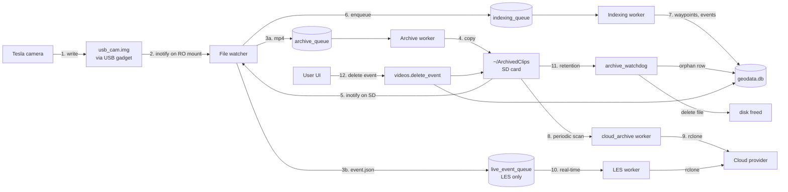
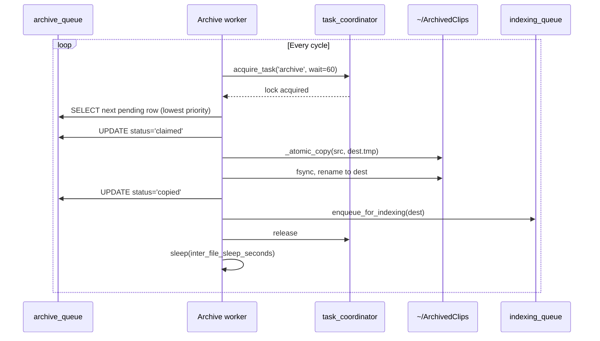
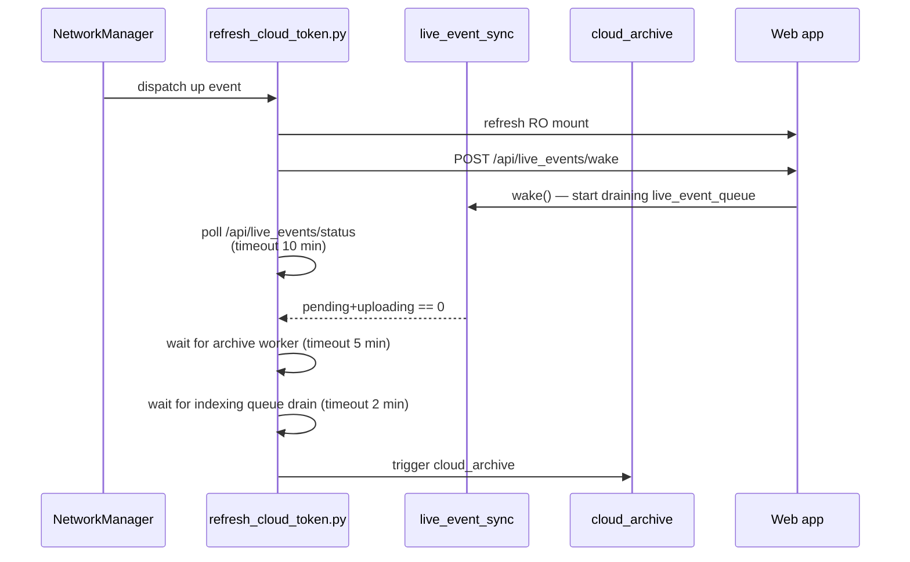
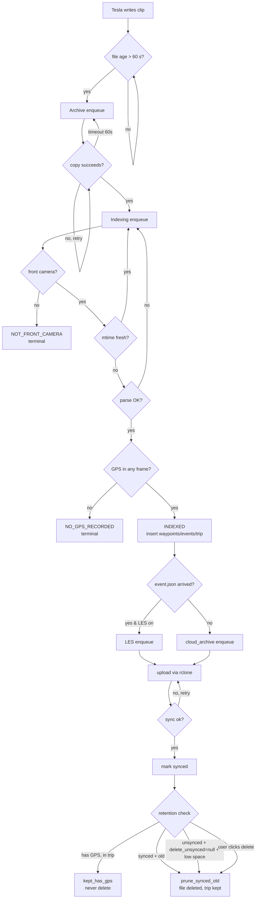

# Video Lifecycle

> The flagship narrative. Follow one Tesla-recorded clip from the
> moment the camera starts capturing it through every decision the
> device makes — archive, index, map, cloud, retention, deletion.
> If you read only one document, read this one.

This doc describes the **complete journey of a single video clip**:

1. **Tesla writes the file** to the USB gadget
2. **The file watcher detects it**
3. **The archive worker copies it** to the SD card
4. **The indexer parses it** — extracts GPS, telemetry, and detects events
5. **Mapping merges it into a trip** (or doesn't)
6. **The cloud uploader queues it** (bulk catch-up vs real-time)
7. **Retention eventually prunes it**
8. **Or the user deletes it manually**

Every branch the device can take at every stage is enumerated. Each
section ends with a decision-point table you can scan for
"what if?" answers.

For a description of the components themselves (without the
narrative), see [`ARCHITECTURE.md`](ARCHITECTURE.md). For
definitions of recurring terms (LUN, mvhd, LES, quick_edit, …) see
[`GLOSSARY.md`](GLOSSARY.md).

---

## At a glance



The top-level data flow is **strictly producer-queue-consumer**.
There are exactly four queues (`archive_queue`, `indexing_queue`,
`live_event_queue`, `cloud_synced_files`); each has exactly one
worker thread that drains it. Producers never bypass the queue;
workers never spawn more workers. This is what keeps the Pi Zero
2 W from melting under load.

---

## Stage 1 — Tesla writes the file

### What Tesla does

Tesla mounts `usb_cam.img` (LUN 0) as a normal USB mass-storage
device. While driving or in Sentry standby, it writes:

| Folder         | When                                                     | Files per minute     |
|----------------|----------------------------------------------------------|----------------------|
| `RecentClips/` | Continuously, rolling buffer (~60 minutes retained)      | 6 (one per camera)   |
| `SavedClips/<event-dir>/` | User taps the dashcam-save button             | 6 + `event.json`     |
| `SentryClips/<event-dir>/` | Sentry alarm triggers                        | 6 + `event.json`     |

`event.json` is small (< 1 KB) and is **always written last** in
an event folder, atomically — Tesla finalizes the .mp4s first,
then writes event.json as the closing marker. We rely on this
ordering: the file watcher uses `event.json` arrival as the signal
that the event folder is fully populated.

### What's happening underneath

Tesla writes via the **gadget block layer**: byte-level writes go
to the kernel's USB Mass Storage gadget driver (`f_mass_storage`),
which serves them out of the `usb_cam.img` file directly. The
filesystem on the image is exFAT.

The Pi reads the same image file via VFS (the local mount of the
loop device on top of `usb_cam.img`). Tesla and the Pi can
read/write the same image file concurrently — there is no lock
contention between the two paths because they hit the file
through different I/O paths.

### Tesla onboard-clock caveat

Tesla derives the `YYYY-MM-DD_HH-MM-SS-camera.mp4` filename prefix
from the **car's onboard local clock**, not GPS time. When the car
loses GPS time-sync (long underground parking, GPS antenna fault),
the clock drifts. We have observed clips written under the wrong
date by 19+ hours.

The MP4 `mvhd` atom (Movie Header) carries the **GPS-derived UTC
start-of-recording time** and is immune to onboard-clock drift.
The indexer reads `mvhd` first and falls back to the filename
only when the atom is unreadable. **Never write code that uses
the filename for absolute time decisions.**

### Decisions at this stage

| Question                              | Outcome / Rule                                                  |
|---------------------------------------|-----------------------------------------------------------------|
| Can Tesla write while we're reading?  | Yes — gadget block layer and VFS don't contend                  |
| Are filenames trustworthy?            | No — use `mvhd` for absolute time                                |
| Is `event.json` written last?         | Yes — rely on it as the "folder ready" marker                    |
| Is RecentClips persistent?            | No — Tesla overwrites at ~60 min unless we copy it first         |

---

## Stage 2 — The file watcher detects it

`scripts/web/services/file_watcher_service.py` runs a single
thread using Linux inotify, with a 5-minute polling fallback for
filesystems where inotify isn't reliable.

### What's watched

- `/mnt/gadget/part1-ro/TeslaCam/` (recursive) — the read-only
  USB mount
- `~/ArchivedClips/` (recursive) — the SD-card archive folder

### Callback types

The watcher exposes **four** distinct callback subscriptions; each
has its own producer concern:

| Callback                              | Fires on                                          | Subscribes to                  | Age gate                   |
|---------------------------------------|---------------------------------------------------|--------------------------------|----------------------------|
| `register_callback(cb)`               | New `.mp4` arrivals                               | Archive producer / indexer     | **60 s** (`_MIN_FILE_AGE_SECONDS`) |
| `register_event_json_callback(cb)`    | New `event.json` arrivals                         | Live Event Sync                | None — fires immediately   |
| `register_delete_callback(cb)`        | File deletes (rotation, manual)                   | Indexer (orphan cleanup)       | N/A                        |
| `register_archive_callback(cb)`       | New file in `~/ArchivedClips/`                    | Indexer (post-archive enqueue) | 60 s                       |

The 60-second age gate on `.mp4` files is the **"not still being
written"** check: Tesla finalizes a clip in seconds, but the gate
absorbs jitter and accidental early-trigger calls from inotify.

The **no age gate on event.json** is deliberate — Tesla writes
event.json atomically as the last step of finalizing an event
folder, so by the time inotify reports it the file is complete.
LES therefore wakes immediately (no 60-second delay between Tesla
finishing the event and the cloud upload starting).

### Polling fallback

inotify can miss events when the underlying filesystem is mounted
or remounted (which we do during quick_edit). To recover, the
watcher polls `_POLL_INTERVAL_SECONDS` (300 — every 5 minutes)
and re-fires callbacks for files it didn't see during inotify
downtime. **Both callback types fire from the polling path, too.**

### Decisions at this stage

| Condition                                         | Action                                                           |
|---------------------------------------------------|------------------------------------------------------------------|
| New `.mp4` mtime > 60 s old                        | Fire archive callback + (after archive) indexing callback        |
| New `.mp4` mtime ≤ 60 s old                        | Skip; will re-check next poll                                    |
| New `event.json`                                  | Fire LES callback **immediately**, no age gate                    |
| inotify silent for 5 minutes                      | Run polling sweep                                                 |
| Watched mount unmounted (mode switch)             | Watcher pauses; resumes on remount                                |

---

## Stage 3 — The archive worker copies it

`scripts/web/services/archive_worker.py`. Single-thread consumer
of `archive_queue` (in `cloud_sync.db`).

### Why we copy

Tesla's RecentClips folder rotates at ~60 minutes — once Tesla
overwrites a clip, it's gone forever. Sentry / Saved events live
on the USB drive longer but still take Tesla USB space. By copying
to the SD card we:

1. Preserve clips past Tesla's rotation
2. Free Tesla's USB space (Tesla's own retention removes copied
   clips on its next pass)
3. Give the indexer a stable path to parse from (the RO USB mount
   is volatile during Tesla writes)

**Critical rule**: the indexer **never** parses files directly
from the RO USB mount. Tesla can rotate or rewrite a clip mid-parse,
which causes `FILE_MISSING` errors and broken DB rows. Indexing
runs only against files in `~/ArchivedClips/`.

### Producer side

`archive_producer.py` enqueues files into `archive_queue`:

| Trigger                         | When                                               |
|----------------------------------|---------------------------------------------------|
| Boot catch-up scan              | Once at gadget_web start                           |
| File watcher callback            | Every new `.mp4` on the RO USB mount               |
| Manual trigger                   | UI "Archive Now" button                            |

### Worker side: the loop



### Priority ordering

`archive_queue.PRIORITY_*` constants (lower number = higher):

| Constant                   | Value | Folders matched                             |
|----------------------------|-------|---------------------------------------------|
| `PRIORITY_EVENTS`          | 1     | `SentryClips/`, `SavedClips/`               |
| `PRIORITY_RECENT_CLIPS`    | 2     | `RecentClips/`                              |
| `PRIORITY_OTHER`           | 3     | Anything else                               |

Events drain before RecentClips because event clips are
irreplaceable (a Sentry trigger is a one-time signal); RecentClips
have continuous coverage so a small prioritization delay is fine.

### `_atomic_copy` guards

The copy itself is **heavily throttled** to keep the SDIO bus
from saturating and starving the watchdog daemon:

| Guard                                | Default | Purpose                                                                  |
|--------------------------------------|---------|--------------------------------------------------------------------------|
| `inter_file_sleep_seconds`           | 1.0 s   | Pause between files                                                      |
| `chunk_pause_seconds`                | 0.25 s  | Pause every chunk **inside** a single copy                                |
| `per_file_time_budget_seconds`       | 60.0 s  | Hard ceiling on a single copy; raises `_CopyTimeBudgetExceeded`          |
| `load_pause_threshold`               | 3.5     | If `loadavg[0] >= 3.5` between files, sleep `load_pause_seconds`         |
| `load_pause_seconds`                 | 30 s    | How long to sleep when load is high                                       |
| `boot_scan_defer_seconds`            | 30 s    | Don't run boot catch-up scan for the first 30 s after gadget_web start    |
| `nice` priority                      | -19 (low) | Process scheduled at lowest CPU priority                                |
| `ionice` class                       | idle    | Block-I/O priority is "idle" — only runs when nothing else needs the disk |

The **mid-copy guards** (`chunk_pause_seconds`, `per_file_time_budget_seconds`)
fire **inside** `_atomic_copy`. If a single copy takes longer than
60 seconds, `_CopyTimeBudgetExceeded` releases the claim back to
`pending` *without* bumping `attempts` — the file is fine, the
system is overloaded, so a row can never reach `dead_letter`
purely from load.

### Status transitions

```
                  ┌────────────┐
                  │  pending   │
                  └─────┬──────┘
                        ▼
                  ┌────────────┐
                  │  claimed   │
                  └─────┬──────┘
            ┌─────────┬─┴───┬──────────┐
            ▼         ▼     ▼          ▼
     ┌──────────┐ ┌────┐ ┌──────┐ ┌─────────────┐
     │  copied  │ │err │ │source│ │skipped_     │
     │(terminal)│ │    │ │_gone │ │stationary   │
     └──────────┘ └─┬──┘ └──────┘ └─────────────┘
                   │
                   ▼
               ┌─────┐
               │retry│ → pending (with backoff)
               └─────┘
                   ↓ attempts >= max
               ┌──────────┐
               │dead_letter│
               └──────────┘
```

### Decisions at this stage

| Condition                                          | Outcome                                                              |
|----------------------------------------------------|----------------------------------------------------------------------|
| Source file no longer exists when claimed          | `source_gone` (terminal) — Tesla rotated it out before we got to it |
| Source file is older than retention horizon        | `skipped_stationary` (terminal) — too old to be worth copying        |
| Copy completes successfully                        | `copied` (terminal) — enqueue for indexing                           |
| Copy raises `_CopyTimeBudgetExceeded` (≥60 s)      | Release claim back to `pending`, don't increment `attempts`           |
| Copy raises any other exception                    | `error` → retry with backoff                                          |
| `attempts >= retry_max_attempts`                   | `dead_letter`                                                         |
| `loadavg[0] >= 3.5` between files                  | Sleep 30 s, then retry from queue                                     |
| LES has a pending row                              | Yield: release lock, sleep briefly, re-acquire                        |

---

## Stage 4 — The indexer parses it

`scripts/web/services/indexing_worker.py`. Single-thread consumer
of `indexing_queue` (in `geodata.db`).

### What "indexing" means

For each archived `.mp4`:

1. Parse the H.264 stream's SEI (Supplemental Enhancement
   Information) NAL units to extract Tesla's per-frame telemetry
   payload (GPS, speed, accelerations, gear, autopilot state,
   blinkers, brake, steering).
2. Read the `mvhd` atom for the absolute UTC start time.
3. Insert one `waypoints` row per parsed frame.
4. Run event detection over the waypoint sequence.
5. Insert any triggered events into `detected_events`.
6. Update or merge a `trips` row.
7. Insert a booking row in `indexed_files`.

### `index_single_file` returns a typed `IndexResult`

The result carries an `IndexOutcome` enum value plus details:

| `IndexOutcome`            | What it means                                                  | Next action                                           |
|---------------------------|----------------------------------------------------------------|-------------------------------------------------------|
| `INDEXED`                 | Successfully parsed and stored                                 | Delete queue row (terminal)                           |
| `ALREADY_INDEXED`         | `indexed_files` already has a matching row                     | Delete queue row (terminal)                           |
| `DUPLICATE_UPGRADED`      | New file is a higher-quality dup of an existing row            | Replace existing, delete queue row (terminal)         |
| `NO_GPS_RECORDED`         | Frames had no GPS telemetry (parking-lot recording)            | Insert `indexed_files`, no waypoints, terminal        |
| `NOT_FRONT_CAMERA`        | File is `*-back.mp4` / `*-left_repeater.mp4` etc.              | Skip (only the front cam carries the canonical SEI)   |
| `TOO_NEW`                 | mtime within `mapping.index_too_new_seconds` (default 120 s)   | Defer with backoff                                    |
| `FILE_MISSING`            | File deleted between enqueue and parse                         | Delete queue row (terminal)                           |
| `PARSE_ERROR`             | SEI/mvhd parse raised                                          | Retry with backoff                                    |
| `DB_BUSY`                 | SQLite returned BUSY                                           | Retry with backoff                                    |

The retry set is **`{TOO_NEW, PARSE_ERROR, DB_BUSY}`**. All other
outcomes are terminal — successful or not, the queue row is
deleted. After enough retries, the row moves to a separate
dead-letter state (visible on `/jobs`).

### Front camera only

Tesla writes 6 cameras per minute (`-front`, `-back`,
`-left_repeater`, `-right_repeater`, `-left_pillar`,
`-right_pillar`). Only the **front camera** carries the canonical
SEI telemetry — the other five mirror it but it's redundant. We
parse only `*-front.mp4`. The other five rows still get archived
(for playback) but they never enter the indexing queue.

### Trip merge

After waypoints are inserted, the indexer decides whether they
belong to an existing trip:

```
Take the new clip's first waypoint.
Find the most recent existing waypoint with timestamp before this one.
If gap_seconds < trip_gap_minutes (default 5 min):
    merge into the existing trip
    extend its end_time / end_lat / end_lon
Else:
    create a new trip row
```

**The gap math uses `strftime('%s', x)` for exact integer-second
arithmetic**, never `(julianday(a) - julianday(b)) * 86400` —
the latter has float precision issues that misclassify boundary
gaps. (See PR #78 for the bug history.)

### Event detection

`mapping_service.detect_events()` scans the waypoints and may
insert rows for:

- `harsh_brake`, `emergency_brake` — based on negative
  acceleration thresholds
- `hard_acceleration` — positive acceleration threshold
- `sharp_turn` — steering-angle + speed combination
- `speeding` — over a configured limit
- `fsd_engage`, `fsd_disengage` — autopilot state transitions

All thresholds live under `mapping.event_detection` in
`config.yaml`.

### Decisions at this stage

| Condition                                              | `IndexOutcome`             |
|--------------------------------------------------------|----------------------------|
| Filename is not `*-front.mp4`                           | `NOT_FRONT_CAMERA`         |
| File mtime within last 120 s                            | `TOO_NEW`                  |
| `indexed_files` has matching row already                 | `ALREADY_INDEXED`          |
| New file is a larger / longer dup of existing            | `DUPLICATE_UPGRADED`       |
| No GPS in any parsed frame                               | `NO_GPS_RECORDED`          |
| Parse raises                                             | `PARSE_ERROR`              |
| SQLite BUSY                                              | `DB_BUSY`                  |
| File missing at parse start                              | `FILE_MISSING`             |
| Everything succeeded                                     | `INDEXED`                  |
| New waypoints' first ts within 5 min of an existing trip | Merge into that trip       |
| Otherwise                                                | Create new trip            |

---

## Stage 5 — Cloud upload

There are **two cooperating cloud uploaders**, both producing into
the same provider via shared rclone helpers but with distinct
queues, distinct triggers, and distinct cadences. They never run
rclone concurrently — `task_coordinator` serializes them.

### Path A: bulk catch-up (`cloud_archive_service`)

Drains `cloud_synced_files` (status `pending`) one file at a time.

- **Triggers**: WiFi reconnect (NM dispatcher), file-watcher new
  file (after archive), periodic timer
- **Priority order**: events first → geolocated next → non-event
  last (and non-event is **opt-in**, off by default via
  `cloud_archive.sync_non_event_videos: false`)
- **Coordination**: holds `task_coordinator('cloud_sync')` for one
  file, then releases. Between files, checks
  `live_event_sync_service.has_ready_live_event_work()` — if LES
  has a pending row, yields the lock.

### Path B: real-time per-event (`live_event_sync_service`, "LES")

Drains `live_event_queue`. Triggered by `event.json` arrival via
the file watcher's dedicated callback (no polling, no second
inotify watcher).

- **Default**: `live_event_sync.enabled: false`. When disabled, no
  callback is registered, no thread starts, the queue table is
  unused.
- **Worker**: a single dedicated thread that **idles on
  `threading.Event.wait()`** when the queue is empty (< 0.1% CPU).
  Wakes when (a) `enqueue_event_json` is called or (b) the NM
  dispatcher hits `/api/live_events/wake`.
- **File selection**: `live_event_sync.upload_scope` — `event_minute`
  (default; event.json + the 6 cameras matching the
  `YYYY-MM-DD_HH-MM` prefix) or `event_folder` (every `.mp4` in
  the dir).
- **Retry**: 5 attempts with exponential backoff `[30 s, 120 s,
  300 s, 900 s, 3600 s]`. After the last attempt, the row is
  `failed` and stays there until manual retry via
  `/api/live_events/retry/<id>`.
- **WiFi-aware**: when WiFi is down, queue grows but worker idles;
  on reconnect, drains immediately.
- **Daily cap**: `live_event_sync.daily_data_cap_mb` (0 =
  unlimited). When hit, worker idles until midnight local.
- **Webhook**: `live_event_sync.notify_webhook_url` fired via
  stdlib `urllib.request` after a successful upload (no
  `requests` import — keeps RSS budget intact).

### The arbitration contract

When WiFi reconnects, the NM dispatcher
(`refresh_cloud_token.py`) does this in order:



**LES gets to drain before cloud_archive starts.** The cap is 10
minutes (`_LIVE_EVENT_TIMEOUT_SECONDS`); after that cloud_archive
runs anyway and they coexist with mid-file yielding.

### Power-loss safety on the cloud side

A file is marked `synced` only **after** rclone confirms upload AND
the DB commit completes AND fsync returns. If power dies mid-upload:

- The partially uploaded file's row is still `uploading`.
- On startup, `_startup_recovery()` resets every `uploading` row
  back to `pending`.
- The next sync cycle re-uploads. rclone's chunked uploads are
  resumable for providers that support it.

### Decisions at this stage

| Condition                                                | Outcome                                                  |
|----------------------------------------------------------|----------------------------------------------------------|
| LES enabled + new event.json                              | Enqueue into `live_event_queue`; wake LES worker         |
| LES disabled                                              | Event clip goes through the normal cloud_archive path    |
| WiFi down                                                 | Worker idles; queue grows                                 |
| WiFi reconnects                                           | LES drains first; cloud_archive waits up to 10 min        |
| LES has pending work + cloud_archive is running           | cloud_archive yields between files                        |
| `cloud_archive.sync_non_event_videos: false` + non-event  | Skip — only events + geolocated clips uploaded           |
| Daily cap exceeded                                        | LES idles until local midnight                            |
| Upload fails 5 times                                      | LES row → `failed`, requires manual retry                 |

---

## Stage 6 — Retention prune

The clip is now on the SD card, indexed, possibly cloud-uploaded.
Sooner or later retention will reclaim its disk space.

### `archive_watchdog` — the periodic guard

Runs from `gadget_web`. Walks `~/ArchivedClips/` and asks per-file:

1. How old is this clip?
2. Does it have GPS? Is it part of an indexed trip?
3. Has it been cloud-synced (`cloud_synced_files.status = synced`)?
4. Is the SD card running out of space?

Then it picks a **bucket** and acts:

| Bucket           | Criterion                                             | Action                                                    |
|------------------|-------------------------------------------------------|-----------------------------------------------------------|
| `kept_has_gps`   | Has GPS, indexed, part of a trip                      | Keep — these are the irreplaceable trip recordings        |
| `kept_event`     | Sentry / Saved event, recently captured               | Keep                                                       |
| `kept_synced`    | Recently synced to cloud, within retention horizon    | Keep                                                       |
| `prune_synced_old` | Synced + older than `default_retention_days`        | Delete file                                                |
| `prune_unsynced_old` | Unsynced + older + `delete_unsynced` allows it    | Delete file                                                |

### The "delete_unsynced" three-state config

`cloud_archive.delete_unsynced` is **tri-state** (`null` / `false` / `true`):

| Value     | Behavior                                                                  |
|-----------|---------------------------------------------------------------------------|
| `null`    | Auto: delete unsynced only when free space drops below the target         |
| `false`   | Never delete an unsynced clip — keep them forever, even at disk-full risk |
| `true`    | Delete unsynced clips at the same age as synced ones                      |

The default is `null` (the auto behavior). `false` is for users
who want a guaranteed local-only retention; `true` is for users
who treat the cloud as canonical.

### Sacred trips rule

When retention deletes a clip, `mapping_service.purge_deleted_videos()`
is called. This function:

1. Removes the matching `indexed_files` row.
2. **Sets `waypoints.video_path = NULL`** for every waypoint that
   referenced the deleted file.
3. **Sets `detected_events.video_path = NULL`** for every event
   that referenced it.
4. **Does NOT touch the `trips` row**. The trip happened — losing
   the dashcam clip doesn't unhappen the drive.

This rule was hardened after the May 7 2026 regression where a
naive cleanup cascade-deleted an entire McDonald's trip's data
when the source clip rotated out. The contract now is:

> **Trips are sacred. Only an explicit user "Delete Trip" action
> may remove them.**

This is enforced in code (`purge_deleted_videos` doesn't take a
trip-deletion path) and in the design system (no UI button
deletes trips silently — only a deliberate user action).

### Watchdog actionability

Retention can also raise a banner in the UI when free space gets
critical. The banner has two flags:

- `severity` — `info` / `warning` / `error` / `critical`
- `actionable` — `true` only when there's something the user can
  *do* (worker stalled with pending work, or disk critically full)

The UI shows the "footage may be lost" banner only when both
`severity ∈ {error, critical}` AND `actionable === true`. The
distinction matters because non-actionable critical states (e.g.,
"the cleanup is in progress and disk is briefly low") shouldn't
spam users with banners they can't dismiss with action.

### Decisions at this stage

| Condition                                                | Bucket / Action                                                |
|----------------------------------------------------------|----------------------------------------------------------------|
| Has GPS + part of a trip                                  | `kept_has_gps` — never deleted by retention                    |
| Sentry / Saved event, within event retention             | `kept_event`                                                    |
| Synced, within `default_retention_days`                   | `kept_synced`                                                   |
| Synced + older than retention                             | `prune_synced_old` — delete file, NULL `video_path` references |
| Unsynced + `delete_unsynced=null` + free space ok        | Keep                                                             |
| Unsynced + `delete_unsynced=null` + free space low       | `prune_unsynced_old` — delete                                   |
| Unsynced + `delete_unsynced=false`                       | Keep regardless                                                  |
| Unsynced + `delete_unsynced=true` + age past retention   | `prune_unsynced_old` — delete                                   |
| Free space critical + worker idle                        | `actionable=true` → banner shown                                |
| Free space critical + worker actively pruning            | `actionable=false` → banner suppressed                          |

---

## Stage 7 — User deletion

Users can also delete clips manually from the UI. Two entry
points:

### Delete a single event

`scripts/web/blueprints/videos.py::delete_event(folder, event_name)`

- Validates `folder` against the allowed set (`SentryClips`,
  `SavedClips`, `RecentClips`, `ArchivedClips`).
- Validates `event_name` doesn't contain path traversal.
- Removes the file/dir from `~/ArchivedClips/`.
- Calls `purge_deleted_videos()` so DB references go to NULL.
- Returns JSON success/failure.

### Delete a trip (rare; the only way to remove a `trips` row)

A separate explicit user action — **the only code path that
deletes a `trips` row.** Deletes the trip and its waypoints / events
in a single transaction. This is the explicit "I don't want this
drive in my history" action.

### Decisions at this stage

| Condition                          | Outcome                                                 |
|------------------------------------|---------------------------------------------------------|
| User clicks "Delete event"          | File removed; `video_path` references NULLed; trip kept |
| User clicks "Delete trip" (rare)    | Trip + its waypoints + events all removed               |
| Filename contains `..` or `/`       | 400 — rejected                                           |
| Folder not in allowed set           | 400 — rejected                                           |

---

## Tying it together: the full clip-lifetime decision tree



---

## Cross-cutting safety rules

These apply at every stage. Violating any of them has caused
real production incidents (cited in the relevant
copilot-instructions sections).

1. **Background subsystems never unmount or rebind the USB
   gadget.** Tesla may be recording at any moment. Any UDC
   unbind / LUN clear / RO→RW remount of part1 loses footage.
   The only USB-disrupting operations are user-initiated
   (`quick_edit_part2`, mode switch, gadget rebind after lock
   chime change). Background workers (archive, indexer, file
   watcher, cloud_archive, LES) are read-only consumers.
2. **Tesla writes via the gadget block layer; we read via VFS.**
   No lock contention. Concurrent reads/writes of the same image
   file are fine.
3. **VFS cache invalidation on the RO mount uses
   `echo 2 > /proc/sys/vm/drop_caches` (slabs only).** Never
   `umount -l + remount` — that breaks the gadget's view.
4. **mvhd over filename for absolute time.** Always.
5. **Trips are sacred.** Only an explicit user delete may remove
   a `trips` row. `purge_deleted_videos` only NULLs `video_path`.
6. **Index from `~/ArchivedClips/` only.** Never from the RO USB
   mount. Tesla may rotate a clip mid-parse.
7. **One rclone subprocess at a time.** Coordinated via
   `task_coordinator` keys `'cloud_sync'` and `'live_event_sync'`.
8. **No new dependencies in `live_event_sync_service.py`.** The
   25 MB RSS steady-state ceiling on Pi Zero 2 W is enforced by
   code review. `urllib.request` for webhooks; never `requests`.
9. **Atomic copy + fsync + rename for every file write.** Power
   cuts at any time.

---

## Where to read next

- [`ARCHITECTURE.md`](ARCHITECTURE.md) — the component-level view
  of everything described above.
- [`GLOSSARY.md`](GLOSSARY.md) — every term defined.
- [`contributor/core/DATABASES.md`](contributor/core/DATABASES.md)
  — the database tables this doc references.
- [`contributor/core/CONFIGURATION_SYSTEM.md`](contributor/core/CONFIGURATION_SYSTEM.md)
  — every config key cited above.
- *(planned, Wave 3)* `contributor/subsystems/VIDEO_ARCHIVE.md`,
  `VIDEO_INDEXING.md`, `MAPPING_AND_TRIPS.md`, `EVENT_DETECTION.md`,
  `TELEMETRY_AND_SEI.md`, `FILE_WATCHER.md`.
- *(planned, Wave 4)* `contributor/subsystems/CLOUD_ARCHIVE.md`,
  `LIVE_EVENT_SYNC.md`.
- *(planned, Wave 7)*
  `contributor/flows/POWER_LOSS_RECOVERY.md`,
  `MODE_SWITCH_PRESENT_TO_EDIT.md`,
  `MODE_SWITCH_EDIT_TO_PRESENT.md`.

---

## Source files

The lifecycle described above touches these modules. When any of
them changes in a way that affects the per-stage decisions, update
this doc.

- `scripts/web/services/file_watcher_service.py` — Stage 2
- `scripts/web/services/archive_producer.py` — Stage 3 producer
- `scripts/web/services/archive_worker.py` — Stage 3 worker
- `scripts/web/services/archive_queue.py` — Stage 3 status enum,
  priority constants
- `scripts/web/services/archive_watchdog.py` — Stage 6 retention
- `scripts/web/services/indexing_worker.py` — Stage 4 worker
- `scripts/web/services/indexing_queue_service.py` — Stage 4 queue API
- `scripts/web/services/mapping_service.py` — Stage 4
  (`index_single_file`, `IndexResult`, `IndexOutcome`,
  trip merge, `purge_deleted_videos`)
- `scripts/web/services/mapping_queries.py` — read-only map queries
- `scripts/web/services/cloud_archive_service.py` — Stage 5 path A
- `scripts/web/services/live_event_sync_service.py` — Stage 5 path B
- `scripts/web/services/task_coordinator.py` — fairness lock
  contract
- `scripts/web/helpers/refresh_cloud_token.py` — NM dispatcher
- `scripts/web/blueprints/videos.py::delete_event()` — Stage 7
