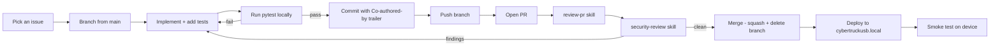

# Development Workflow

The full cycle for any change to TeslaUSB: branch, test, commit, PR,
review, deploy. Following this consistently is what keeps the device
stable in production.

---

## At a glance



---

## 1. Pick an issue

Work is tracked in [GitHub Issues](https://github.com/mphacker/TeslaUSB/issues).
The two most common entry points:

- The `resolve-issue` skill (`.github/skills/resolve-issue/SKILL.md`)
  takes an issue number and runs the full investigation → branch →
  fix → test → PR cycle.
- For ad-hoc work, branch and code as described below.

Either way, **never push to `main` directly** — every change goes
through a PR.

---

## 2. Branch from `main`

```bash
git checkout main
git pull --ff-only origin main
git checkout -b <type>/<issue>-<short-slug>
```

Branch naming convention:

| Prefix     | Use for                                          | Example                        |
|------------|--------------------------------------------------|--------------------------------|
| `fix/`     | Bug fixes (closes a specific issue)              | `fix/180-failed-jobs-ux`       |
| `feat/`    | New features                                      | `feat/65-wraps-preview`        |
| `docs/`    | Documentation-only changes                        | `docs/wave-1-foundation`       |
| `refactor/`| Internal restructuring (no behavior change)       | `refactor/issue-72-io-storm`   |

Always branch from a freshly pulled `main` so your diff is minimal.

---

## 3. Implement + add tests

For any code change, **add or update pytest coverage** for the new
behavior. The repo currently has ~1600 tests and that's the bar — a
PR that adds new behavior without tests should expect "missing test"
findings in review.

Per-subsystem test conventions live in the dedicated subsystem docs;
for now, follow the patterns in the existing `tests/test_*.py` file
that matches your area.

For docs-only changes, no tests are required.

---

## 4. Run the test suite

```bash
python -m pytest --tb=short -q
```

The full suite runs in ~70 seconds on a developer machine. Always
run it before pushing.

For faster iteration on a single area:

```bash
python -m pytest tests/test_<module>.py --tb=short -q
```

There is **no automated CI**; the test run is your responsibility.
Reviewers will re-run if a finding is uncertain.

---

## 5. Commit

Always sign commits with the Copilot Co-authored-by trailer
(required by the project's `git_commit_trailer` policy):

```
Fix #180 — gate archive watchdog banner on actionability

<body explaining what changed and why>

Co-authored-by: Copilot <223556219+Copilot@users.noreply.github.com>
```

Commit message conventions:

- **Subject line** starts with `Fix #N`, `Feat #N`, `Docs:`, or
  `Refactor:` and is **≤ 72 characters**.
- **Body** explains *what* and *why*, not *how* (the diff shows how).
- For multi-paragraph bodies, leading bullets are fine.
- **Reference the issue** in the subject line so GitHub auto-links.

---

## 6. Push and open the PR

```bash
git push -u origin <branch-name>
gh pr create --repo mphacker/TeslaUSB --base main --head <branch-name> \
  --title "<short subject>" --body-file <prepared-body>.md
```

**PR description requirements:**

- One-paragraph summary of *what changed* and *why*.
- A test summary (`Tests: 1606 passed, 4 skipped` or similar).
- For multi-commit PRs, a bullet list of the commits.

The body should be **specific enough that a reviewer can decide
whether to merge without reading the diff first**.

---

## 7. Code review via the `review-pr` skill

For non-trivial PRs, run the project's review skill against your own
PR before requesting human review:

```
review-pr <PR number>
```

The skill (`.github/skills/review-pr/SKILL.md`) checks the diff
against project conventions: configuration compliance, mount safety,
path traversal, subprocess security, image gating, Flask blueprint
patterns, template deployment correctness, resource efficiency,
power-loss safety, and security. It posts the review directly to
the PR.

You **cannot self-approve your own PR** via the skill — the skill
posts a review comment instead.

---

## 8. Security review

Every PR that touches code (not just docs) gets a security review
via the `security-review` skill, which runs in `changed` mode against
the PR diff. It's invoked automatically inside `review-pr` and covers:

- Subprocess injection (no `f-string + shell=True`)
- Path traversal (filename sanitization, `os.path.commonpath` checks)
- Configuration security (no hardcoded secrets)
- Mount and gadget safety
- Network exposure (port-80 captive portal is intentional; nothing
  else listens publicly)
- WiFi AP security
- File upload validation (extension, size, content)
- Root privilege usage (only services that need it)
- Dependency security (no new heavyweight imports without
  justification on Pi Zero 2 W)
- Data protection (no PII in logs, no credentials in commits)

A clean security review is required before merge.

---

## 9. Merge

After review approval (or for low-risk changes the user merges
directly), squash-merge and delete the branch:

```bash
gh pr merge <number> --repo mphacker/TeslaUSB --squash --delete-branch
```

**Squash merge is the project default.** Each merged PR maps to a
single commit on `main`, making `git log` and bisect easy.

---

## 10. Deploy to the device

The reference device is `cybertruckusb.local` (SSH access). Deploy
flow:

```bash
ssh pi@cybertruckusb.local
cd ~/TeslaUSB
git pull --ff-only origin main
sudo systemctl restart gadget_web.service
```

For most code changes (Python services, Flask blueprints, Jinja
templates, static assets), `git pull` + `systemctl restart
gadget_web.service` is enough.

**You only need to re-run `setup_usb.sh` if** any of the following
changed:

- A file under `templates/` (systemd unit, NM dispatcher, sshd
  drop-in)
- A shell script under `scripts/` that gets installed somewhere
- The web service's *deployment* path (rare)
- A package dependency (rare)

After `git pull`, **always**:

1. Verify the service is up: `systemctl is-active gadget_web.service`
2. Smoke-test the area you changed in the browser.

---

## 11. Smoke test

Browser tests on the device are run via the live URL:

- `http://cybertruckusb.local`

Verify:

- The page you changed renders without errors.
- The action you changed (button, form, API call) succeeds.
- The system health card on `/` (or `/api/system/health`) reports
  no new failures.

For interactive flows (camera-switch, mode change, chime upload),
walk through the user steps once.

If the smoke test reveals a regression, **revert your change on the
device immediately** (`git reset --hard HEAD~1 && systemctl restart
gadget_web.service`) and reopen the PR.

---

## Common tooling

| Tool                | Purpose                                                        |
|---------------------|----------------------------------------------------------------|
| `gh` CLI            | All GitHub operations (PR, issue, review, comment, merge)      |
| `pytest`            | Test runner; configured via `pytest.ini`                       |
| `git`               | Version control; never `git stash -u` near runtime data files  |
| `journalctl`        | Logs (`-u gadget_web.service -f`)                              |
| `systemctl`         | Service management on the device                                |
| `ssh`               | Connect to `cybertruckusb.local`                                |

---

## Things to never do

These are the workflow-level repeats of the rules in
`.github/copilot-instructions.md`. Internalize them.

1. **Never `git stash -u`** anywhere near runtime data files
   (`*.db`, `state.txt`, `*.bak.*`, `tesla_salt.bin`). The
   `.gitignore` is hardened against committing them, but a stash
   captures untracked files.
2. **Never push directly to `main`.** Every change goes through a PR.
3. **Never install dependencies inside the repo** (no `node_modules/`,
   no scratch `package.json`). Test tooling lives outside the
   working tree.
4. **Never commit secrets.** Cloud creds are encrypted at rest by
   `crypto_utils.py`; OAuth tokens never touch the repo.
5. **Never run `setup_usb.sh` to deploy a one-file template change**
   if you can avoid it — `setup_usb.sh` has interactive prompts that
   hang on closed stdin and re-runs many setup steps. For one-off
   template tweaks, sed-substitute the placeholders manually and
   `systemctl daemon-reload`.
6. **Never deploy without smoke testing.** A passing local pytest
   does not guarantee the device behaves correctly — the device runs
   on a Pi Zero 2 W with real SDIO bus contention and real Tesla
   recordings.

---

## Source files

- `.github/copilot-instructions.md` — the dense rule-set every PR
  is reviewed against
- `.github/skills/review-pr/SKILL.md` — the PR review skill
- `.github/skills/security-review/SKILL.md` — the security review skill
- `.github/skills/resolve-issue/SKILL.md` — the end-to-end issue
  resolution skill
- `pytest.ini` — pytest configuration
- `tests/conftest.py` — shared test fixtures
